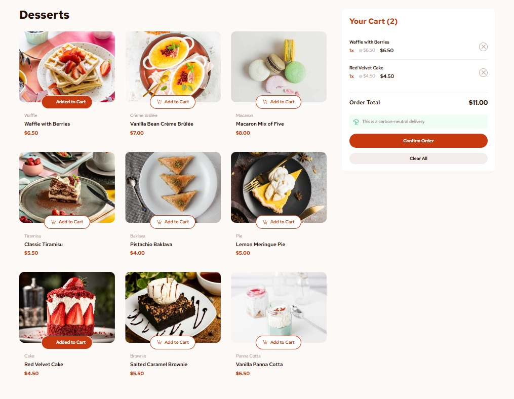
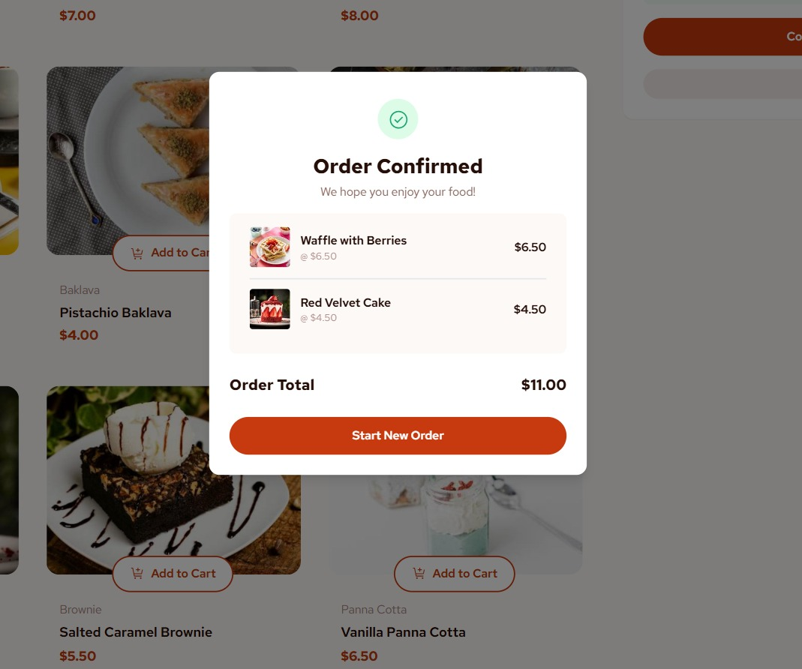

# 🎂 Dessert Cart App

This project demonstrates how to use `useReducer` in a React + TypeScript + Vite application to manage a simple cart system. You can add items to the cart, remove individual items, clear all items, and view a summary of your order.

---

## 🔧 Features

* Display a list of hardcoded products
* Add to Cart functionality
* Remove individual items from cart
* Clear all items from cart
* View total price and summary of items

---

## 💡 Topics Covered

* `useReducer` for state management
* Component communication via context
* Tailwind CSS styling
* TypeScript types

---

## 📸 Screenshots
<div style="display: flex; gap: 16px;">
  
  
</div>

## 🖥️ Tech Stack


---

## 🚀 Getting Started

```bash
npm install
npm run dev
```

---

## 📁 Folder Structure

```
/src
  /components
  /features
  /types
  App.tsx
  main.tsx
```

---

## 📦 Build

```bash
npm run build
```

---
## 🙋‍♀️ Author

**Sanya Shresta Jathanna**

[](https://github.com/SanyaShresta25)
[](https://www.linkedin.com/in/sanya-shresta-jathanna)
[](https://sanyashresta.netlify.app/)

